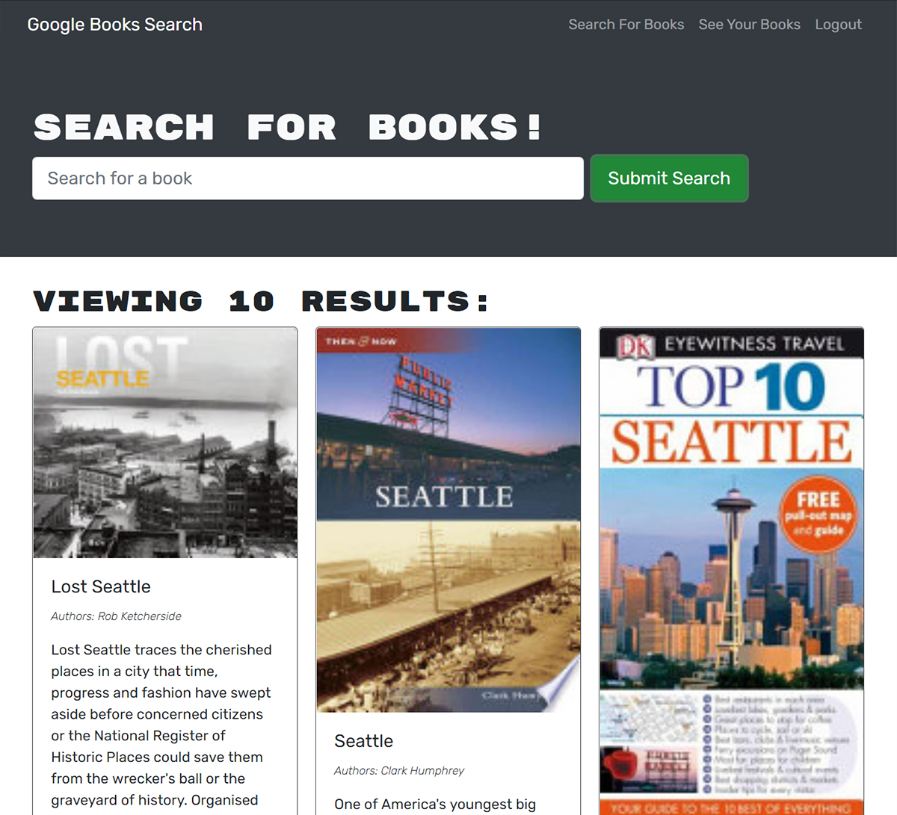

# Book Search Engine

[](https://opensource.org/licenses/MIT)

## Description

The original version of this Google book search engine was built as a MERN stack application using a RESTful API. My goal was to refactor the app to use Apollo Server and a GraphQL API while retaining the original functionality for the user. By carefully dissecting the RESTful version and testing using tools like Insomnia I was able to create mirror GraphQL queries and mutations to replace the API routes. Much of the client side refactor took place in the React components as hooks, useQuery and useMutation. This app also uses JSON Web Tokens for authentication which are passed in through context middleware for queries and mutations. The app itself allows users to create accounts, search Google books api, save books to a dashboard, and remove books from the dashboard.

## Table of Contents

- [User Story](#user-story)
- [Live Site](#live-site)
- [Technologies](#technologies)
- [License](#license)
- [Contact](#contact)

## User Story
```
AS AN avid reader
I WANT to search for new books to read
SO THAT I can keep a list of books to purchase
```

## Live Site

https://book-search-engine-wlc.herokuapp.com/



## Technologies

- Apollo Server
- Apollo Provider
- GraphQL
- JWT (JSON Web Token)

## License
Licensed under the MIT License - https://opensource.org/licenses/MIT

## Contact

If you have any questions you can email me at williamcrownover1@gmail.com.

You can also check out my other work on GitHub at [WilliamCrownover](https://github.com/WilliamCrownover)
